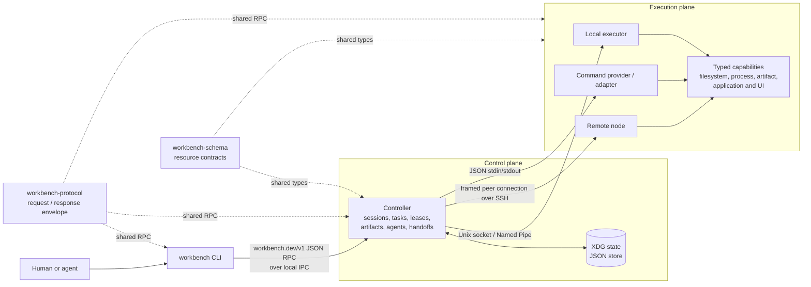

# distributed-workbench

An open, domain-neutral control plane for distributed development workbenches.

The project models workspace sessions, executors, typed capabilities, driver
and resource leases, observable tasks, immutable artifacts, agents, and
structured handoffs. Domain products integrate through capability providers
and adapters; the core does not know about any particular application,
document type, build system, or UI harness.

## Architecture



The Controller owns orchestration and durable control-plane state. Executors
perform node-local operations within configured roots and advertise typed
capabilities. External integrations remain replaceable providers behind the
same request/response protocol; transport selection does not change the
resource model. Driver and resource leases fence concurrent writers, while
tasks and immutable artifacts make execution observable and transferable.

Nodes with both roles share one persistent peer transport with another node;
Controller and Executor are logical services, not separate connections. See
[`docs/fabric-architecture.md`](docs/fabric-architecture.md).
For the breaking 0.2 rollout, see [`docs/upgrade-0.2.md`](docs/upgrade-0.2.md).

## Binaries

- `workbench`: stable CLI and JSON protocol client.
- `workbench controller serve`: local controller over a Unix socket or Windows Named Pipe.
- `workbench executor serve`: executor over a Unix socket or Windows Named Pipe.

State follows XDG conventions. The default namespace is
`distributed-workbench` under `$XDG_CONFIG_HOME`, `$XDG_STATE_HOME`, and
`$XDG_CACHE_HOME`.

## Repository boundary

- tmux integration belongs in `tmux-agent-workbench` as a provider.
- private workflow and product adapters belong in their owning private
  repositories.
- macOS protected operations must be performed by the signed Rust executor,
  not by an interpreter spawned by an adapter.

## macOS protected-operation identity

`scripts/install-macos-app.sh` installs a minimal signed `Agent Workbench.app`
under the XDG data directory and starts its executable through a user launch
agent. The independent app/launchd responsibility chain gives TCC prompts the
stable identity `Agent Workbench` (`dev.distributed-workbench.macos-agent`),
instead of attributing access to a Python or shell parent. The standalone
binary remains supported for hosts that do not invoke TCC-protected APIs.

Successful macOS and Linux installs prune stale deployment build trees and
state backups. The installed deployment, newest deployment workspace, and five
newest backups are retained. Audit or apply the same policy manually with
`scripts/prune-state.sh --installed-version "$(workbench --version | awk '{print $2}')"`
and the additional `--apply` flag. Override the counts with
`DISTRIBUTED_WORKBENCH_KEEP_DEPLOYMENTS` and
`DISTRIBUTED_WORKBENCH_KEEP_BACKUPS`.

## Linux user deployment

Build and install a node-local Controller and Executor as systemd user units:

```sh
cargo build --release --bin workbench
scripts/install-linux-user.sh target/release/workbench node-id "$HOME/Code" "$HOME/.local/state"
```

The installer writes the executable to `~/.local/bin`, service units below
`$XDG_CONFIG_HOME/systemd/user`, and sockets/state below `$XDG_STATE_HOME`. It
registers the local Executor with the local Controller after both services are
ready.

## Bootstrap a development fabric from a laptop

Describe the desired, domain-neutral nodes and safety roots with the
[`Fabric` schema](schemas/fabric.schema.json). Validate a manifest before
bootstrap:

```sh
workbench fabric validate --file examples/fabric.yaml
workbench fabric plan --file examples/fabric.yaml
```

Product adapters and profiles do not belong in this manifest. Each node names
its OS and CPU architecture explicitly so release compatibility fails during
planning instead of during installation.

After installing the macOS app on the laptop, select SSH-configured POSIX and
native Windows development hosts and converge them on the same release:

```sh
scripts/bootstrap-fabric.sh devbox-a devbox-b
scripts/bootstrap-fabric.sh devbox-a windows:windows-devbox
```

The command installs the checksum-verified release on every selected host,
enables its user-level Controller and Executor services, creates one persistent
peer transport for every node pair, registers both roles in every Controller,
performs federated calls in both directions, restarts each peer once, and
verifies route recovery with a newer connection generation. It is idempotent.
Use `--version 0.2.0` to pin a release or `--verify-only` to audit an existing
installation without changing it; the read-only audit still exercises both
logical directions. For a version already installed from a local build, use
`--version VERSION --skip-release-install`; service setup, registration, and
topology verification still run.

If a Controller is unresponsive, repair the native supervisors before delegating
back to normal bootstrap verification:

```sh
scripts/repair-fabric.sh --version 0.4.8 --local-id laptop devbox-a devbox-b
```

The repair command uses the selected nodes' native launchd, systemd, or Windows
Service supervisors, then runs the pinned `bootstrap-fabric.sh` reconciliation
with a bounded timeout. It first performs a read-only verification to preserve
connection-generation evidence, and falls back to reconciliation if registration
is missing. It restarts Controllers and managed peers, but does not restart
Executors.

Every node retains its own Controller and Executor. The laptop initiates its
SSH connections to devboxes. A persistent full-duplex framed channel on SSH
stdin/stdout lets devbox roles call laptop roles without a devbox-initiated
connection or SSH socket forwarding.

Agents should use the repository's [`workbench-fabric` skill](skills/workbench-fabric/SKILL.md)
for installation, upgrade, topology reconciliation, and transport diagnosis.
Product-specific skills remain above this layer and call only their local
Controller; they must not reproduce fabric bootstrap or SSH behavior.

## Windows native deployment

Windows nodes run the same Rust Controller, Executor, and peer protocol natively.
Run an elevated PowerShell to install both roles as auto-starting Windows
Services with restart recovery:

```powershell
.\scripts\install-from-release.ps1 latest
```

Enable the built-in OpenSSH Server for inbound peer connections. Node-local IPC
uses Named Pipes; WSL and MSYS2 are not runtime dependencies. Use WSL2 only when
you intentionally want an additional Linux node, WSL1 only for legacy
compatibility, and MSYS2 only for interactive tooling.

For a Windows node that dials another devbox, the `DistributedWorkbenchPeer_*`
Windows Service must have a machine-level OpenSSH configuration and key that
can reach that peer. Laptop-to-Windows links need only the normal laptop SSH
identity because the laptop remains the physical dialer.

## Prebuilt releases

Tagged releases publish checksum-protected archives for Linux x86_64, Apple
Silicon macOS, and Windows x86_64 on the [GitHub Releases page](https://github.com/lukewang1024/distributed-workbench/releases).
Install the latest compatible release from a checkout with:

```sh
scripts/install-from-release.sh latest
```

On Linux, pass explicit executor roots after the version when the checkout or
state directory is outside the defaults. Preserve a registered executor name
with `DISTRIBUTED_WORKBENCH_EXECUTOR_ID`:

```sh
DISTRIBUTED_WORKBENCH_EXECUTOR_ID=devbox-a-rust \
  scripts/install-from-release.sh latest /data00/home/me/Code /home/me/.local/state
```

The macOS archive contains both the CLI and the `workbench-macos-agent` used to
construct the stable `Agent Workbench.app` TCC identity. Linux archives install
the CLI plus Controller and Executor systemd user services. `SHA256SUMS` is
generated from the exact uploaded archives for independent verification.

## Development

```sh
cargo fmt --check
cargo test --workspace
cargo clippy --workspace --all-targets -- -D warnings
```
